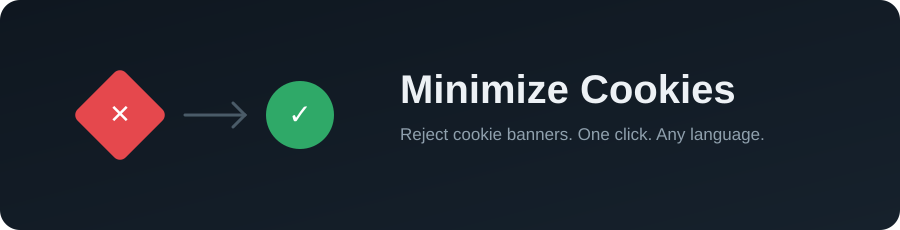

  

  <a href="./README.md">English</a> · <b>Español</b>

  
  
  
  

  Un userscript de Tampermonkey que detecta banners de consentimiento de
  cookies en (casi) cualquier web y rechaza todo por ti — sin leer letra
  pequeña, sin buscar el enlace de rechazo escondido.

  <a href="https://dratlopez.github.io/Minimize_cookies/">🌐 Web del proyecto</a> ·
  <a href="./Minimize_cookies-1.8.js">⬇️ Instalar script</a> ·
  <a href="#-cómo-funciona">🧠 Cómo funciona</a>

---

> [!TIP]
> Aparece un pequeño rombo rojo en la esquina superior derecha en cuanto
> se detecta un banner de cookies. Lo pulsas una vez — si el rechazo se
> ejecutó de verdad, se convierte en un check verde. Nunca simula un
> éxito que no ha ocurrido.

## ✨ Características

- 🧠 **API nativa primero**: llama directamente a `OneTrust.RejectAll()`, `Cookiebot.submitCustomConsent()`, `Didomi.setUserDisagreeToAll()` o `UC_UI.denyAllConsents()` cuando existen — la vía de rechazo más fiable que hay.
- 🕸️ **Consciente de Shadow DOM**: muchos banners modernos esconden su contenido dentro de Shadow DOM anidado. Este script también mira ahí.
- 🌍 **Reconocimiento de texto multi-idioma**: detecta frases de "rechazar todo" (y palabras sueltas como "Denegar") en español, inglés, francés, alemán, italiano, portugués y neerlandés.
- 🪜 **Cascada de respaldo**: si no hay un botón directo de "rechazar todo", abre el panel de preferencias, apaga cada interruptor, y pulsa Guardar/Confirmar — siempre en ese orden de prioridad.
- ✅ **Indicador de éxito honesto**: el rombo solo se pone verde cuando se ejecutó una acción de rechazo real — no cuando simplemente se ocultó el banner.
- 🔒 **Cero permisos**: `@grant none`. Solo toca el DOM de la propia página en la que estás.

## 🧠 Cómo funciona

El script nunca hace clics a ciegas. Recorre esta lista de prioridad y se detiene en el primer paso que aplique:

| Paso | Acción | Por qué va primero |
|---|---|---|
| **0** | Llamar a la API nativa del CMP (OneTrust, Cookiebot, Didomi, Usercentrics) | La propia plataforma expone una función para esto exactamente. |
| **1** | Coincidir con un selector/ID conocido de botón de rechazo | Casi tan fiable, para cuando la API no está expuesta. |
| **2** | Buscar por texto un botón de "rechazar todo", en 8+ idiomas | Cubre CMPs sin API pública ni clases identificables. |
| **3** | Abrir el panel de preferencias ("Personalizar", "Configuración de privacidad"...) | Muchos sitios esconden el rechazo real un nivel más adentro. |
| **4** | Apagar cada interruptor y pulsar Guardar/Confirmar | Último recurso, cuando no existe "rechazar todo" en ningún nivel. |

## 🍪 Plataformas reconocidas

`OneTrust` · `Cookiebot` · `Didomi` · `Usercentrics` · `Quantcast Choice` · `Sourcepoint` · `TrustArc` · banners artesanales · widgets basados en Shadow DOM

## ⚙️ Instalación

1. Instala un gestor de userscripts — [Tampermonkey](https://www.tampermonkey.net/) en escritorio (Chrome, Firefox, Edge, Safari). En móvil, solo **Firefox para Android**, **Kiwi Browser** o **Yandex Browser** soportan extensiones — Chrome/Safari móviles no.
2. Abre Tampermonkey → *Crear nuevo script*, borra el contenido de ejemplo, y pega el contenido de [`Minimize_cookies-1.8.js`](./Minimize_cookies-1.8.js). Guarda con `Ctrl/Cmd + S`.
3. Navega con normalidad. El rombo rojo aparecerá arriba a la derecha en cuanto se detecte un banner de cookies.
4. Pulsa el rombo. Si el rechazo tuvo éxito, se vuelve un check verde durante un par de segundos y desaparece.

## ⚠️ Limitaciones honestas

- No existe una solución universal al 100%: algunos banners totalmente personalizados pueden no estar reconocidos todavía.
- El indicador verde certifica que se ejecutó una acción de rechazo real; no puede verificar del lado del servidor qué hace la web con esa preferencia.
- ¿Encontraste una web donde falla? Abre un [issue](https://github.com/dratlopez) con una captura del banner — cuantas más variantes se documenten, más fiable se vuelve esto.

## 📄 Licencia

Copyright © 2026 **DrATLopez Andino Tur López**.
Publicado bajo licencia **[Creative Commons Atribución-NoComercial 4.0 (CC BY-NC 4.0)](https://creativecommons.org/licenses/by-nc/4.0/)**.

Repositorio oficial: [github.com/dratlopez](https://github.com/dratlopez)
