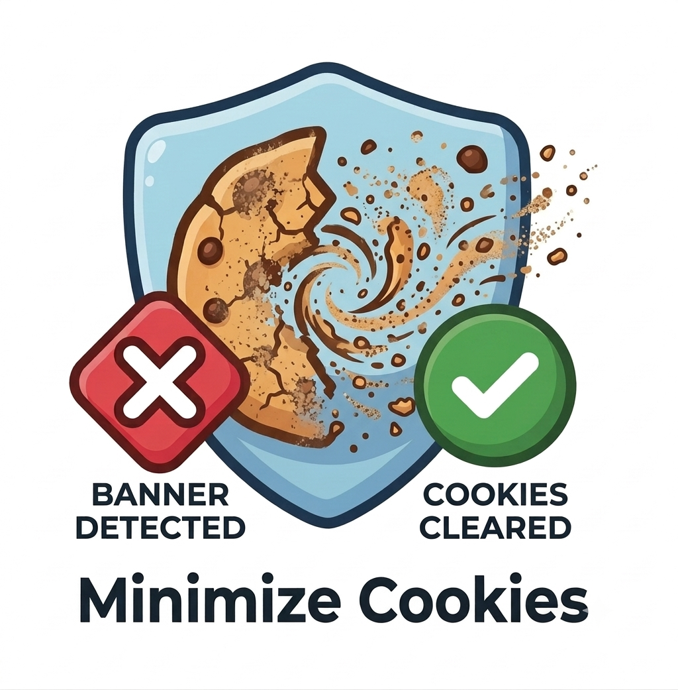

  

  <a href="./README.md">English</a> · <b>Español</b>

  
  
  
  

  Un userscript de Tampermonkey que detecta banners de consentimiento de
  cookies en (casi) cualquier web y rechaza todo por ti — sin leer letra
  pequeña, sin buscar el enlace de rechazo escondido.

  <a href="https://dratlopez.github.io/Minimize_cookies/">🌐 Web del proyecto</a> ·
  <a href="./Minimize_cookies-3.7.js">⬇️ Instalar script</a> ·
  <a href="#-cómo-funciona">🧠 Cómo funciona</a>

---

> [!TIP]
> Aparece una pequeña cara en la esquina superior derecha en cuanto se
> detecta un banner de cookies. Su color indica cuánta seguridad tiene
> el script, y su expresión indica qué está haciendo en cada momento.
> Pulsa una vez — si el rechazo se ejecutó de verdad, se convierte en un
> check verde. Nunca simula un éxito que no ha ocurrido.

## ✨ Características

- 🧠 **API nativa primero**: llama directamente a `OneTrust.RejectAll()`, `Cookiebot.submitCustomConsent()`, `Didomi.setUserDisagreeToAll()`, `UC_UI.denyAllConsents()` / `__ucCmp.denyAllConsents()` (Usercentrics) o `__cmp('setConsent', 0, …)` (consentmanager.net) cuando existen — la vía de rechazo más fiable que hay.
- 🕸️ **Consciente de Shadow DOM**: muchos banners modernos esconden su contenido dentro de Shadow DOM anidado. Este script también mira ahí.
- 🌍 **Reconocimiento de texto multi-idioma**: detecta frases de "rechazar todo" (y palabras sueltas como "Denegar") en español, inglés, francés, alemán, italiano, portugués y neerlandés, con cobertura parcial en polaco, sueco, noruego y finés.
- 🪜 **Cascada de respaldo**: si no hay un botón directo de "rechazar todo", abre el panel de preferencias, apaga cada interruptor, y pulsa Guardar/Confirmar — siempre en ese orden de prioridad.
- 🎯 **Consciente de su propia confianza**: cada detección se clasifica como alta, media o baja (ver abajo), así que el icono solo actúa por sí solo cuando está razonablemente seguro — nunca adivina ante una coincidencia débil.
- 🔁 **Auto-continuación**: en sitios que abren un segundo panel tras el primer toque (o que tardan en cargarlo), el script sigue por su cuenta — ver [Las expresiones del icono](#-las-expresiones-del-icono) más abajo.
- ✅ **Indicador de éxito honesto**: el icono solo se pone verde cuando se ejecutó una acción de rechazo real — no cuando simplemente se ocultó el banner.
- 🔒 **Cero permisos**: `@grant none`. Solo toca el DOM de la propia página en la que estás.

## 🎨 Las expresiones del icono

El icono es una pequeña cara cuyo **color** refleja cuánta confianza tiene la detección, y cuya **expresión** refleja qué está pasando en ese momento:

| Color | Confianza | Significado | ¿Se puede pulsar? |
|---|---|---|---|
| 🔴 Rojo | Alta | Coincidió la API nativa del CMP o un selector conocido y de confianza | Sí |
| 🟠 Naranja | Media | Se verificó un banner genérico (texto literal "cookie" + superposición + un botón de acción real) | Sí |
| ⚪ Gris | Baja | *Podría* ser un banner de cookies, pero la señal es demasiado débil para fiarse | No — inerte a propósito, para evitar falsos positivos |

| Expresión | Cuándo aparece | Qué significa |
|---|---|---|
| 🙂 Normal (boca torcida) | Se acaba de detectar un banner | Pulsa para rechazar |
| 😠 Enfadada (boca recta, cejas fruncidas) | Justo después de un toque que no terminó el trabajo | El primer intento no encontró un camino de rechazo completo (p. ej. el botón de "rechazar todo" aún no ha aparecido, o se acaba de abrir un panel de preferencias) |
| 😣 Reintento (boca hacia abajo + cejas fruncidas) | Automáticamente, tras la cara enfadada | El script detectó un banner/panel *nuevo* a los pocos segundos de tu toque y está **continuando solo**, sin que tengas que volver a pulsar |
| ✅ Check verde | Se ejecutó de verdad una acción de rechazo | Éxito — el icono se desvanece poco después |

**Por qué a veces hace falta un segundo (o tercer) paso:** algunos sitios no tienen un único botón de "rechazar todo" — al pulsar una vez se abre un *panel de preferencias*, y solo ahí está la acción real de rechazo/guardado. En lugar de hacerte pulsar dos veces, el script recuerda que acabas de interactuar con un banner de cookies y trata cualquier cosa nueva que aparezca en los siguientes ~20 segundos como parte del mismo flujo, continuando automáticamente (cara de reintento) hasta que o bien tiene éxito (check verde) o se queda sin opciones reconocibles. En algunos sitios lentos esta secuencia puede tardar varios segundos — es lo esperado, no un cuelgue.

## 🧠 Cómo funciona

El script nunca hace clics a ciegas. Recorre esta lista de prioridad y se detiene en el primer paso que aplique:

| Paso | Acción | Por qué va primero |
|---|---|---|
| **0** | Llamar a la API nativa del CMP (OneTrust, Cookiebot, Didomi, Usercentrics, consentmanager.net) | La propia plataforma expone una función para esto exactamente. |
| **1** | Coincidir con un selector/ID conocido de botón de rechazo | Casi tan fiable, para cuando la API no está expuesta. |
| **2** | Buscar por texto un botón de "rechazar todo", en 8+ idiomas | Cubre CMPs sin API pública ni clases identificables. |
| **3** | Abrir el panel de preferencias ("Personalizar", "Configuración de privacidad"...) | Muchos sitios esconden el rechazo real un nivel más adentro. |
| **4** | Apagar cada interruptor y pulsar Guardar/Confirmar | Último recurso, cuando no existe "rechazar todo" en ningún nivel. |

## 🍪 Plataformas reconocidas

`OneTrust` · `Cookiebot` · `Didomi` · `Usercentrics` · `consentmanager.net` · `Quantcast Choice` · `Sourcepoint` · `TrustArc` · banners artesanales · widgets basados en Shadow DOM

## ⚙️ Instalación

1. Instala un gestor de userscripts — [Tampermonkey](https://www.tampermonkey.net/) en escritorio (Chrome, Firefox, Edge, Safari). En móvil, solo **Firefox para Android**, **Kiwi Browser** o **Yandex Browser** soportan extensiones — Chrome/Safari móviles no.
2. Abre Tampermonkey → *Crear nuevo script*, borra el contenido de ejemplo, y pega el contenido de [`Minimize_cookies-3.7.js`](./Minimize_cookies-3.7.js). Guarda con `Ctrl/Cmd + S`.
3. Navega con normalidad. La cara aparecerá arriba a la derecha en cuanto se detecte un banner de cookies.
4. Pulsa el icono. Si el rechazo tuvo éxito, se vuelve un check verde durante un par de segundos y desaparece. Si hace falta otro paso, mostrará la cara de reintento y seguirá por su cuenta (ver [Las expresiones del icono](#-las-expresiones-del-icono)).

## ⚠️ Limitaciones honestas

- No existe una solución universal al 100%: algunos banners totalmente personalizados pueden no estar reconocidos todavía.
- En **sitios con muro de cookies** — aquellos que solo permiten suscribirse/pagar o aceptar las cookies, sin ninguna opción real de rechazo — el script no puede inventar un camino de rechazo que el propio sitio no ofrece.
- El indicador verde certifica que se ejecutó una acción de rechazo real; no puede verificar del lado del servidor qué hace la web con esa preferencia.
- ¿Encontraste una web donde falla? Abre un [issue](https://github.com/dratlopez) con una captura del banner — cuantas más variantes se documenten, más fiable se vuelve esto.

## 📄 Licencia

Copyright © 2026 **DrATLopez Antonio Tur López**.
Publicado bajo licencia **[Creative Commons Atribución-NoComercial 4.0 (CC BY-NC 4.0)](https://creativecommons.org/licenses/by-nc/4.0/)**.

Repositorio oficial: [github.com/dratlopez](https://github.com/dratlopez)
